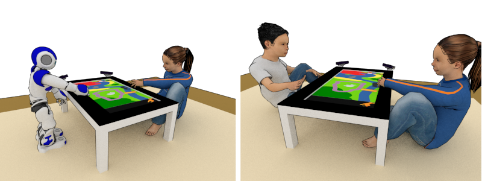
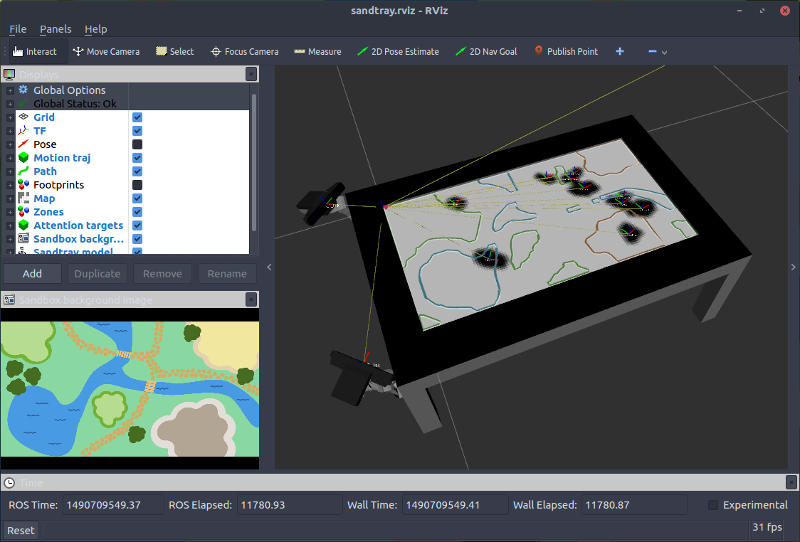

Free-play Sandbox -- Core components
====================================

*This project is part of the 'Free-play Sandbox' experimental framework for Cognitive Human-Robot
Interaction research. [Check the PInSoRo website](https://freeplay-sandbox.github.io/) for details and [documentation](https://freeplay-sandbox.github.io/freeplay-software)*.


ROS interface & autonomous play behaviour



This repository contains  the ROS code for the 'Free-play Sandbox'
experimental framework for HRI.


Installation
------------

*For the entirety of this guide, I will assume you are running Ubuntu Linux on
the touch screen (hereafter named 'sandtray'). In particular, **Windows is not
(and can not be easily) supported**.*

If not yet installed, start by [installing
ROS](http://wiki.ros.org/ROS/Installation) (tested with ROS Kinetic, but
other versions might work as well).

Then:

```
git clone https://github.com/freeplay-sandbox/core.git
cd freeplay-sandbox-ros
mkdir build && cd build
cmake -DCMAKE_BUILD_TYPE=Release ..
make install
```

Usage
-----

First, start `roscore` (and if desired, `rviz`) in a dedicated terminal.

### Starting the free-play sandbox environment

- start the [GUI](https://github.com/freeplay-sandbox/qt-gui)
  (from QtCreator for instance). When needed, press three times in the bottom
  left corner to show the menu.

- `roslaunch freeplay_sandbox interactive_playground.launch`

This launch file:

- broadcast the sandtray 3D model + camera frames;
- build an occupancy map based on the positions of the objects within the sandbox, and provide a 
  A\*-based path planning service to move around said objects;
- creates an action server to move sandbox objects to specific positions, using the path planner;
- process the sandbox background image to extract possible zones (using simple
  colour-based segmentation).



You can open in `rviz` the provided configuration (`config/sandtray.rviz`) to
obtain the above display.

The poses of the various play items are reflected in the `rviz` interface when
interacting with them on the sandtray.

### Artificial player

A simple (rather stupid) autonomous play behaviour can be started, to have the
robot to 'do something'. This basic behaviour is (purposefully) non-social (the
actions of the other users are not taken into account when playing), and can be
used as a baseline of a non-social robot. [See below](#play) the exact play
policy.

The artificial player can be started with or without (default) robot. Currently,
**only Nao is supported**.

#### Without robot

Simply run:

```
$ roslaunch freeplay_sandbox play.launch
```

#### With the robot


```
$ export NAO_IP=<the IP of the Nao>
$ roslaunch freeplay_sandbox play.launch with_robot:=true
```

[See below](#Sandtray-localisation-using-fiducial-markers) to use as well robot localisation using a fiducial marker.

Use `roslaunch --ros-args freeplay_sandbox play.launch` to see the full list of
options.

### Tracking visual focus

Gaze tracking is performed by an independent ROS node,
[gazr](https://github.com/severin-lemaignan/gazr). Install it first, making sure
you enable the ROS support. You will also need a camera, preferably
[calibrated](http://wiki.ros.org/camera_calibration/Tutorials/MonocularCalibration)
(otherwise, the gaze localisation will not be accurate at all). For quick
testing with a desktop webcam, you can download and install the
[gscam](https://github.com/ros-drivers/gscam) driver.

Once gaze tracking work, you can run:

```
$ roslaunch freeplay_sandbox visualfocus_tracking_gscam.launch
```

This launch file:

- starts the `gscam` webcam driver (you might want to set the argument `camera_info_url` to point to
  the calibration file of your webcam).
- starts `gazr`
- computes the intersection between the estimated gaze direction and the
  sandtray.

This intersection, ie the current visual focus of the participant, can be
visualised on the sandtray by enabling the corresponding option in the sandbox
menu (that appears by clicking three times in the bottom left corner).

Data recording
--------------

Two launch files help with recording the interactions. See
[`freeplay-sandbox/analysis`](https://github.com/freeplay-sandbox/analysis)
for data analysis tools.

### Configuration of the recording

The launch file `prepare_recording.launch` starts the video and audio streams,
as well as publish the base TF nodes (sandtray + camera positions).

Video resolution and compression parameters are set either in
`prepare_recording.launch` or in `dual_sr300.launch`.

This launch file expect 2 SR300 cameras and one Kinect 2, used as the
environmental camera.

### Actual recording

The launch file `record.launch` configure and execute `rosbag` to record the
relevant topic. [See the
source](https://github.com/freeplay-sandbox/core/blob/master/launch/record.launch)
for the exact list of recorded topics.

Importantly, the recording duration must be set with `duration:=...` (possible
values include a number of seconds, `10m`, `2h`, etc. - by default, only 1
minute is recorded).

Be aware that the bag file become quickly rather big (expect 500MB/minute).


Nodes documentation
-------------------

### sandbox_map_and_plan

`sandbox_map_and_plan` first wait for the shapes of everything single
sandbox items to be published as marker arrays. By default, listen to the
`/footprints` topic.

After this initial step, it listen over ROS TF for the position of each of the
items, and generate an occupancy map. **Note that the size and resolution of the
map is currently hard-coded to 60x33.5cm, 5cm per cell**.

It then exposes a planning service (`plan_motion`) that uses the A\*
algorithm to plan a path to move an item from A to B.
Upon completion the resulting path is as well published on
the `/sandbox_manipulation_path` topic, for visualisation in RViz.


### move_sandbox_items

This nodes exposes a ROS action server (`move_sandbox_items`) that waits for
a goal (item name, target position), calls the planner, and 'executes' the
motion by publishing a sequence of ROS poses corresponding to virtual touches of
the robot on the surface of the GUI, causing the robot to actually move items
around.

### play

This node actually encodes the play strategy for the robot. Currently, the
following behaviour is hard-coded for the 'Zoo' environment:

at each step,
    - either move one animal to its habitat
    - or one block onto the border of one of the enclosure

Animals and blocks are picked up only if they are in (virtual) arm reach, and
the closest animals/blocks are always prefered.


Advanced features
-----------------

### Sandtray localisation using fiducial markers

By tapping three times on the bottom right corner of the sandbox, a fiducial
marker. This marker can be used by the robot to localise itself wrt to the
sandtray.

When running, a dedicated node (`sandtray_localisation`) listens on a special
topic (by default, `/sandtray/signals/robot_localising`) for a signal (ie, an
empty message).  The signal is emitted by the sandtray when it shows the
fiducial marker. Upon reception of the signal, it attempts to detect a specific
fiducial marker (by default, chilitags '709', can be set with `_marker_id:=...`)
of a specific size (by default 10cm, can be set with `_marker_size:=...`). If
the marker is found within 5 seconds, the node starts to publish a static
transform between frames `_target_frame` (by default, `sandtray`) and
`_reference_frame` (by default, `odom`), thus making all the robot TF frames
visible from the `sandtray` base frame. If the robot successfully detects the
fiducial marker, it says "I know where I am".

Everytime a new signal is received, the transform is updated: if you move the
robot, simply tap again on the bottom right corner, and the robot will
re-localise.

**Pre-requisite**: 
  - [chilitags](https://github.com/chili-epfl/chilitags) (Robust Fiducial Markers for Augmented Reality And Robotics http://chili.epfl.ch/software)
  - [ros_markers](https://github.com/chili-epfl/ros_markers) (the
ROS wrapper for the chilitags library)
  - [freeplay-sandbox/ros-msgs](https://github.com/freeplay-sandbox/ros-msgs) (ROS messages for the freeplay_sandbox experimental framework )

To enable marker-based localisation, launch `play.launch` with the option
`with_marker_localisation:=true`.

### Disabling gnome-shell gestures

To disable `gnome-shell` gestures, open LookingGlass (Alt+F2 > `lg`) and execute
the following command:

```javascript
global.stage.get_actions().forEach(a => a.enabled = false);
```
